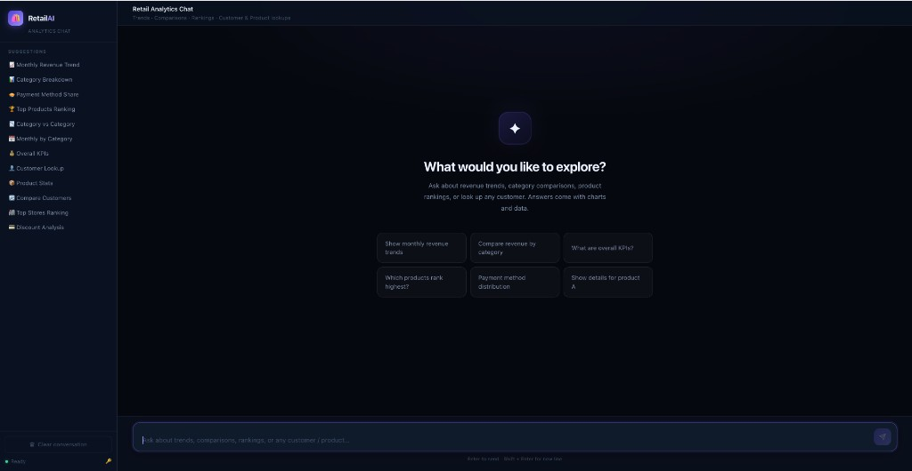
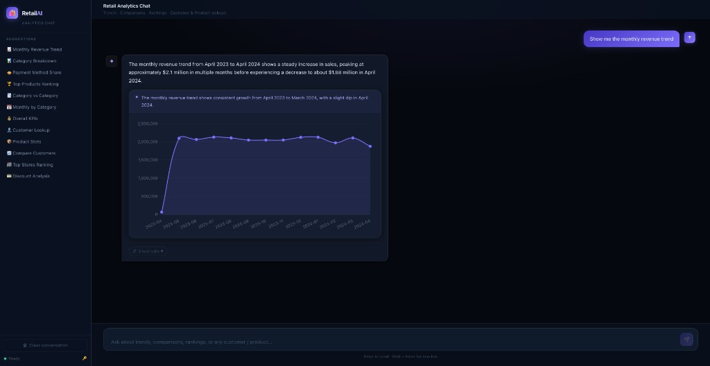
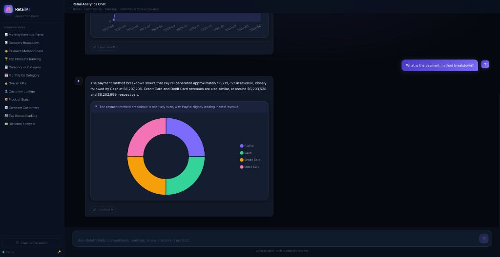
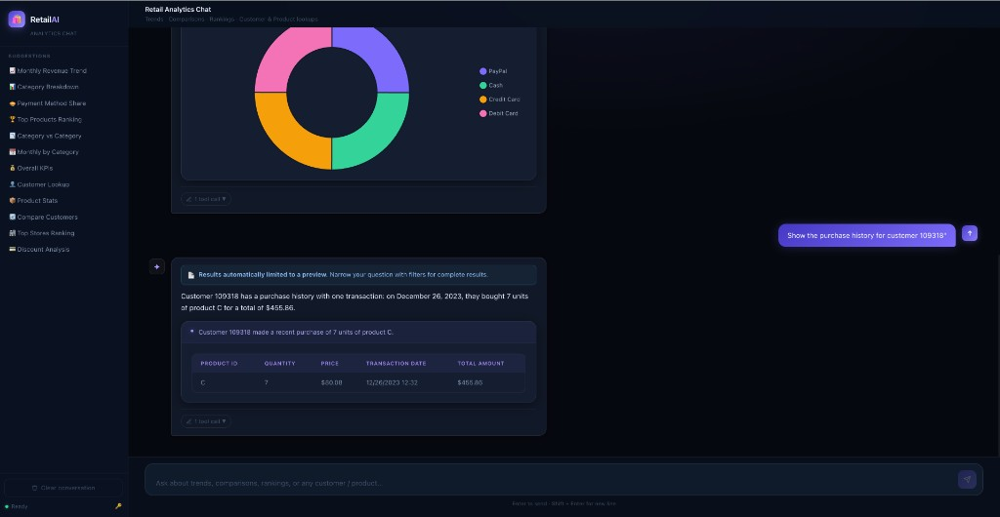
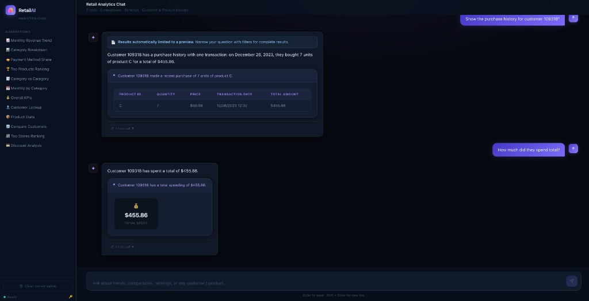
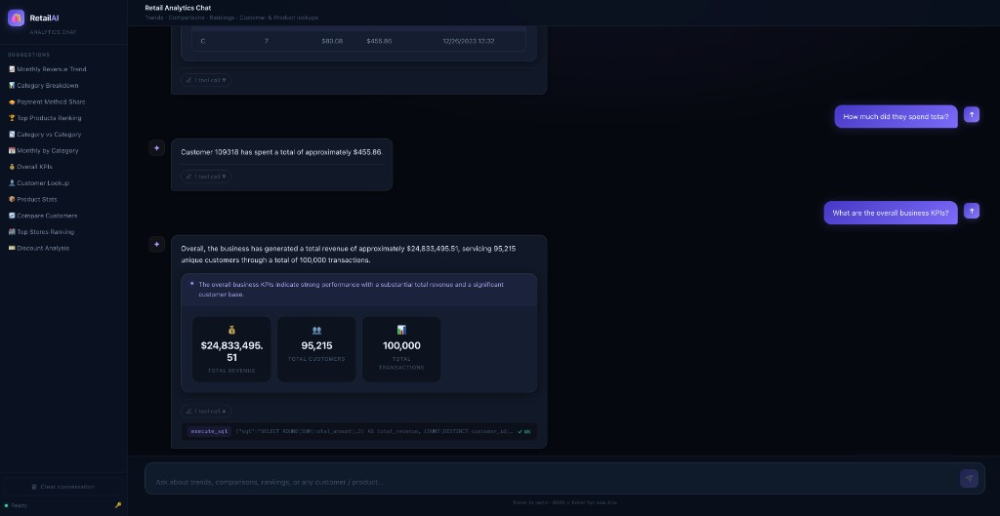
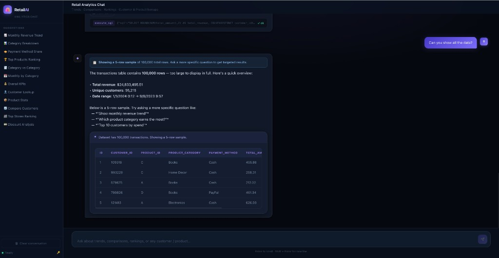

# Retail Data Analytics Chat System

A production-quality, AI-powered retail analytics assistant that lets you ask
natural-language questions about a retail transaction dataset through a chat
interface. The LLM **translates questions into SQL**, the backend **executes
that SQL** against the SQLite retail dataset, and the model returns **grounded
natural-language answers** (and structured visualization hints) built only
from the query results.

---

## Table of Contents

1. [Project Overview](#project-overview)
2. [Demo](#demo)
3. [Architecture & Technical Decisions](#architecture--technical-decisions)
4. [Dataset & Real ID Formats](#dataset--real-id-formats)
5. [Setup Instructions](#setup-instructions)
6. [Running the Backend](#running-the-backend)
7. [Running the Frontend](#running-the-frontend)
8. [Running Tests](#running-tests)
9. [API Reference](#api-reference)
10. [Example Chat Prompts](#example-chat-prompts)
11. [Known Limitations](#known-limitations)
12. [Future Improvements](#future-improvements)

---

## Project Overview

| Item | Detail |
|---|---|
| **Name** | Retail Data Analytics Chat System |
| **Dataset** | Kaggle Retail Transaction Dataset (~200 k rows) |
| **Backend** | FastAPI + Python, SQLite, OpenAI (NL → SQL via `execute_sql` tool) |
| **Frontend** | React + Vite + TypeScript |
| **LLM** | OpenAI GPT-4o-mini (configurable) |
| **Data Store** | SQLite (`data/retail.db`) |

The system answers three categories of questions:

* **Customer queries** – purchase history, total spend, favourite products
* **Product queries** – revenue, units sold, average discount, stores
* **Business metrics** – KPIs, monthly revenue trends, category breakdown, store rankings

---

## Demo

### Welcome screen — suggested prompts to get started



### Monthly revenue trend — line chart visualization



### Payment method breakdown — pie chart with follow-up question



### Customer purchase history — table with transaction details



### Multi-turn conversation — follow-up resolves "they" to the previous customer, with KPI card



### KPI insights — overall business metrics with expandable SQL



### Safety rails — broad-query interception with guided sample and suggestions



---

## Architecture & Technical Decisions

The LLM translates each question into a SQLite `SELECT`, the backend validates
and executes it (SELECT-only, auto-LIMIT, query timeout), and the model returns
a grounded answer from the results. SQLite was chosen for zero-infrastructure
simplicity — one file, fast indexed reads, no server to manage.

Full details — architecture diagram, module map, NL → SQL rationale, safety
rails, data model, intent classification, edge-case table, tradeoffs, and the
evaluation framework — are in [`docs/review_notes.md`](docs/review_notes.md).

---

## Dataset & Real ID Formats

> **Important**: The dataset uses synthetic IDs that differ from examples in
> typical homework descriptions.

| Field | Real Format | Example |
|---|---|---|
| `CustomerID` | Numeric string | `109318`, `579675`, `993229` |
| `ProductID` | Single letter | `A`, `B`, `C`, `D` |
| `ProductCategory` | Text | `Books`, `Clothing`, `Electronics`, `Home Decor` |
| `PaymentMethod` | Text | `Cash`, `Credit Card`, `Debit Card`, `PayPal` |

All example prompts below use real ID formats from the dataset.

---

## Setup Instructions

### Prerequisites

* Python 3.11+
* Node.js 18+
* OpenAI API key

### 1. Clone / download the repository

```bash
git clone <repo-url>
cd retail-analytics
```

### 2. Install backend dependencies

```bash
pip install -r backend/requirements.txt
```

For tests, also install:
```bash
pip install -r backend/requirements-dev.txt
```

### 3. Install frontend dependencies

```bash
cd frontend
npm install
cd ..
```

### 4. Configure environment variables

Copy `.env.example` to `.env` and fill in your values:

```bash
cp .env.example .env
```

Edit `.env`:

```env
OPENAI_API_KEY=sk-your-key-here
OPENAI_MODEL=gpt-4o-mini        # or gpt-4o, gpt-3.5-turbo
DATABASE_PATH=data/retail.db    # relative to repo root
```

**Env var precedence** (highest → lowest):
1. Shell environment (`export OPENAI_API_KEY=...`)
2. `.env` in the **repo root** (recommended; same file `start_backend.sh` sources)
3. Optional `backend/.env` — if present, overrides the same keys from repo-root `.env`
4. Built-in defaults

### 5. Download the dataset

Option A – from Kaggle:
```
https://www.kaggle.com/datasets/fahadrehman07/retail-transaction-dataset/data
```
Download `Retail_Transaction_Dataset.csv` and place it at:
```
data/Retail_Transaction_Dataset.csv
```

Option B – if you already have the file, copy it:
```bash
cp /path/to/Retail_Transaction_Dataset.csv data/
```

### 6. Ingest the dataset

```bash
python scripts/ingest.py
# Or with explicit paths:
python scripts/ingest.py --csv data/Retail_Transaction_Dataset.csv --db data/retail.db

# To force a full reload:
python scripts/ingest.py --reset
```

Expected output:
```
[INFO] Opening database: data/retail.db
[INFO] Loading CSV: data/Retail_Transaction_Dataset.csv
[INFO]   ... 200000 rows inserted
[INFO] Done. Inserted: 200,000  Skipped: 0
[INFO] Database written to: data/retail.db
```

---

## Running the Backend

```bash
# From repo root
uvicorn backend.app.main:app --reload --port 8000
```

The API will be available at `http://localhost:8000`.
Interactive docs: `http://localhost:8000/docs`

---

## Running the Frontend

```bash
cd frontend
npm run dev
```

The frontend will be available at `http://localhost:5173`.
API calls are proxied to `http://localhost:8000` automatically.

---

## Running Tests

```bash
# From repo root – run all unit/API tests (no API key required)
pytest

# Run with verbose output
pytest -v

# Run only repository tests
pytest backend/tests/test_repository.py -v

# Run only API tests
pytest backend/tests/test_api.py -v

# Run integration tests (requires OPENAI_API_KEY)
pytest -m integration -v
```

### Evaluation suite (requires OPENAI_API_KEY)

37 golden cases test the full NL → SQL → Answer pipeline against a deterministic
seed database. An optional LLM-as-judge tier scores answer quality on four
dimensions (correctness, completeness, clarity, grounding).

```bash
# Deterministic assertions only (fast, no extra API cost):
python backend/evals/run_eval.py

# With LLM-as-judge scoring:
python backend/evals/run_eval.py --judge

# Single category (customer, product, kpi, trend, ranking, edge_case, ...):
python backend/evals/run_eval.py --category customer

# Via pytest (each case is a separate test item):
pytest -m eval -v

# With judge via pytest:
EVAL_JUDGE=1 pytest -m eval -v
```

See `docs/review_notes.md` for detailed evaluation methodology and results.

---

## API Reference

### `GET /api/health`
Returns backend status.

```json
{
  "status": "ok",
  "database": "ok",
  "openai_configured": true
}
```

### `POST /api/chat`

Primary analytics surface. The LLM generates SQL, the backend runs it on the
retail database, and the response is grounded in those results.

Request:
```json
{
  "messages": [
    { "role": "user", "content": "What has customer 109318 purchased?" }
  ]
}
```

Response (fields may vary; `structured` holds optional chart/KPI payloads for the UI):
```json
{
  "reply": "Customer 109318 has made ...",
  "structured": {
    "intent": "customer_history",
    "viz_type": "table",
    "insight": "...",
    "chart_data": {},
    "answer": "..."
  },
  "tool_results": [...],
  "metadata": { "model": "gpt-4o-mini", "tool_rounds": 2 }
}
```

---

## Example Chat Prompts

### Customer queries
```
What has customer 109318 purchased?
How much has customer 579675 spent in total?
Show the purchase history for customer 993229
What is the average order value for customer 463050?
Compare customer 109318 and customer 579675
```

### Product queries
```
Show me details for product A
What is the average discount for product C?
Which stores sell product B?
How many units of product D have been sold?
What is the total revenue for product A?
```

### Business analytics
```
What is the total revenue?
Which product categories generate the most revenue?
Show monthly revenue trends
Which stores generate the most sales?
What are the top products by revenue?
How many unique customers do we have?
What is the payment method breakdown?
Who are the top 5 customers by spend?
```

### Follow-up / context queries
```
User: Tell me about customer 109318
User: How much did they spend total?
User: What product did they buy most?

User: Show me details for product A
User: Which stores carry it?
```

---

## Known Limitations

1. **No persistent sessions** – conversation context lives only in the browser.
   Refreshing the page starts a fresh session.
2. **Store location is a full address** – the dataset uses full street addresses as
   the store identifier, not a store code. Queries like "revenue by store" return
   full address strings.
3. **ProductID is a single letter (A–D)** – this is how the dataset is structured.
   There are only four distinct products.
4. **No streaming** – the chat response waits for the full LLM completion before
   rendering. Multiple SQL round-trips may feel slow on complex questions.
5. **OpenAI-only** – the LLM layer is coupled to the OpenAI client. Swapping to
   Anthropic or a local model would require changes in `chat_service.py`.
6. **No authentication** – the API has no authentication layer; do not expose it
   publicly without adding one.

---

## Future Improvements

- [ ] **Streaming + progressive UI** – use `stream=True` with SSE so the user sees tokens as they arrive. For multi-round SQL queries, stream an intermediate "Querying…" status after each tool call so the UI never appears frozen. This removes the perception gap between a 2-second single-query answer and a 10-second multi-step analysis
- [ ] **Caching** – add a simple TTL cache for expensive aggregate queries
- [ ] **Multi-LLM support with intent-based routing** – abstract the LLM client to support Anthropic, Ollama, etc. Route queries by complexity: simple lookups and single-metric questions use a cheap, fast model (e.g. GPT-4o-mini, Haiku); complex multi-step analyses, comparisons, and trend interpretations use a larger model (e.g. GPT-4o, Sonnet)
